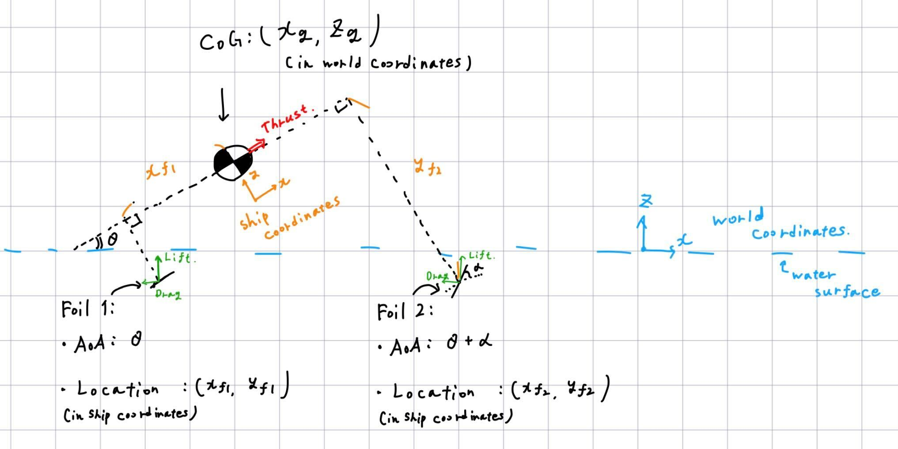

# JSHPBA_scuffed_1Dsim

## 概要

[日本ソーラー・人力ボート協会](http://jsha.blue.coocan.jp/)が開催するソーラー・人力ボート全日本選手権大会に参加する，水中翼を備えたソーラーボート設計のための，ごく単純化したsimulinkモデル

## モデル解説

### モデリング上の仮定

- 船を質点とし、船体や水中翼の支柱に起因する抵抗を無視する。
- 船の姿勢をピッチングのみ、運動を鉛直面上に限定する。
- 推力は重心に発生し、モーメントを生まないとする。
- 水中翼は水面下にあれば深度によらず同じ揚力・抗力を生むとする。

## 実行方法

`params.mat`を読み込んでから`solarboat_1d_sim.slx`を開く

保存時は、Matlab R2022a形式で保存するようにお願いします．

---

### Appendix: `params.mat`に含まれる定数一覧

変数名|詳細
--|--
`Dp`|プロペラ直径[ $m$ ]
`I`|船体の重心回りの慣性モーメント[ $kg\ m^2$ ]
`m_ship`|船体の質量[ $kg$ ]
`rho`|水の密度[ $kg/m^3$ ]
`x_f1`|船体座標系における，主翼(迎え角が調整できない水中翼)のx座標[ $m$ ]
`z_f1`|船体座標系における，主翼のz座標[ $m$ ]
`x_f2`|船体座標系における，副翼(迎え角が調整できない水中翼)のx座標[ $m$ ]
`z_f2`|船体座標系における，副翼のz座標[ $m$ ]

